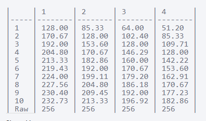

# Tìm hiểu về phương thức lưu trữ Erasure Code của minIO
## Đầu bài:
Nghiên cứu về cách thức lưu trữ Erasure Code của minIO:
 - Nguyên lý hoạt động của Erasure code.
 - Phương pháp thiết kế minIO dựa trên phương thức lưu trữ Erasure code.
 - Cách cấu hình sử dụng Erasure code.

## 1. Nguyên lý hoạt động của Erasure code
 - Không giống như cơ chế Replication (vốn gây lãng phí tài nguyên lưu trữ do phải lưu nhiều bản copy của dữ liệu), erasure code cắt nhỏ dữ liệu ra nhiều mảnh (data chunk), mã hóa chúng bằng các coding chunks, lưu trữ tất cả các chunks này trên tất cả các host của cluster.
  - Erasure code trên minIO hoạt động dựa trên giải thuật [Reed-Solomon](https://en.wikipedia.org/wiki/Reed%E2%80%93Solomon_error_correction), theo công thức `n = k = m`.
    Trong đó:
    - k: số data chunks của dữ liệu gốc bị cắt nhỏ.
    - m: số coding chunks được thêm vào để bảo vệ các data chunks.
    - n: tổng số chunks được tạo ra.
 - Trong thực tế, mỗi chunk này sẽ được lưu trên 1 ổ cứng của cluster, do đó cluster có thể mất tối đa `n` ổ cứng mà dữ liệu vẫn có thể được recovery. Lưu ý: trong thời gian recovery, dữ liệu sẽ ko thể access (đọc hoặc ghi).
 - Tỉ lệ dung lượng của cluster được tính bằng công thức: `n/k`. VD: `5 = 3 + 2`, ta có tỉ lệ dung lượng = 5/3 = 1.6. Để cung cấp được 1GB dữ liệu tới client cần trang bị 1.6GB dung lượng Raw.

## 2. Phương pháp thiết kế minIO dựa trên phương thức lưu trữ Erasure code
  
 - Với mỗi Request read, cluster sẽ đọc dữ liệu từ tất cả các data chunks trước khi ACK về cho client. Với mỗi Request write, cluster sẽ ghi dữ liệu vào tất cả các chunks. Do đó, số lượng data chunks tỉ lệ nghịch với performance.
 - Lượng data chunks càng lớn, CPU càng tốn nhiều hiệu năng để xử lý các chunks, tuy nhiên dung lượng tiết kiệm được càng nhiểu.
 - Ngược lại lượng data chunks ít thì tiết kiệm tài nguyên CPU tuy nhiên gây lãng phí dung lượng (theo công thức `n/k` ở trên).
 - Công thức để tính ra dung lượng Cluster sau khi erasure code: `ER_dunglương = (số lượng ổ đĩa * k / (k+m)) * dung lượng từng ổ đĩa`
 VD: Số lượng ổ đĩa là 64. Dung lượng từng ổ là 4TB, m = 1~4, k = 1~10.
 

## 3. Cách cấu hình sử dụng Erasure code

## Tham khảo:

[1] - https://blog.minio.io/configurable-data-and-parity-drives-on-minio-server-2a34cd49c1b5

[2] - https://hub.packtpub.com/erasure-coding-cold-storage/

[3] - https://github.com/minio/minio/issues/6058

[4] - https://ceph.io/geen-categorie/ceph-erasure-coding-overhead-in-a-nutshell/

[5] - https://www.quobyte.com/blog/2016/08/15/erasure-coding-in-production/