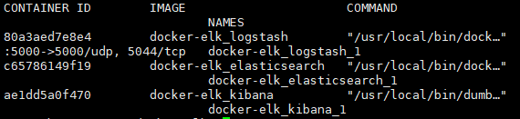
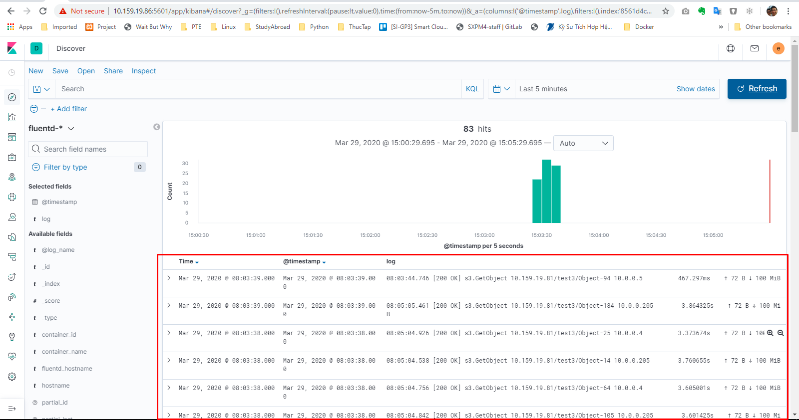
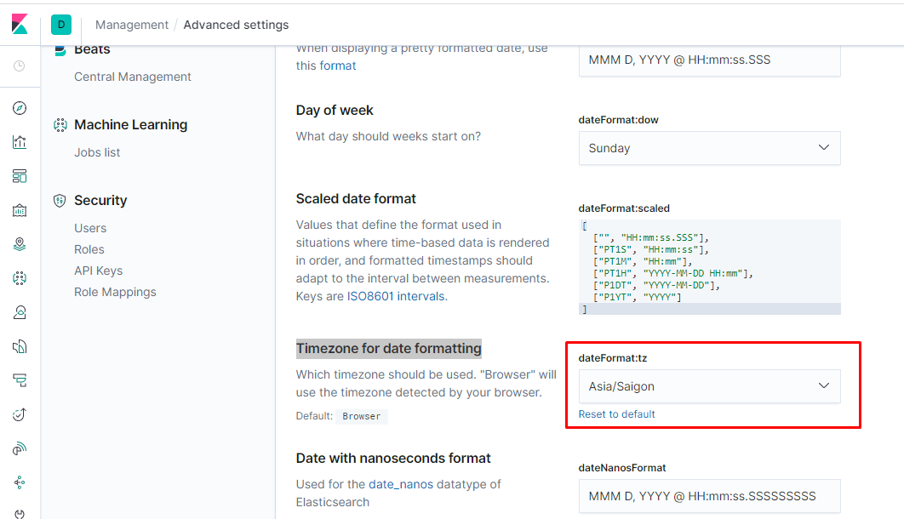

# Hướng dẫn tích hợp thu thập và lưu trữ log HTTP Request cho minIO cluster sử dụng Fluentd+ElasticSearch+Kibana
## Đầu bài:
Thu thập log HTTP Request(tải trực tiếp từ client tới minIO Cluster), quản lý và phân tích các log này để giám sát các thông tin:
 - Số Request thành công
 - Số Request lỗi
 - TimetoFirstBytes
 - Duration của Request

## Giải pháp:
 - minio-client xuất log của minIO cluster
 - Fluentd thu thập log do minio-client xuất ra và chuyển tới ElasticSearch.
 - ElasticSearch lưu trữ và đánh chỉ mục (inđex) cho các log.
 - Kibana visualize log lên biểu đồ.

## Mô hình lab:
 - minIO cluster: gồm 4 node, GW: 10.159.19.81
 - Fluentd được cài đặt trên các host minIO
 - ElasticSearch + Kibana: IP 10.159.19.86. Yêu cầu: Docker engine 17.05 trở lên. 1.5GB Ram trở lên.

## 0. Build image fluentd

### 0.1. Tạo thư mục để lưu các thông tin trong quá trình khởi tạo service fluentd
```sh
mkdir -p ~/fluentd
cd ~/fluentd
```

### 0.2. Để fluentd đẩy được log về elasticsearch, fluentd cần có plugin của elasticsearch, image gốc của fluentd chưa có plugin này, do đó , ta tạo file `Dockerfile` để build image fluentd chứa plugin elasticsearch
```sh
cat << EOF > Dockerfile
FROM fluent/fluentd
USER root
# https://docs.fluentd.org/output/elasticsearch
RUN ["gem", "install", "fluent-plugin-elasticsearch", "--no-rdoc", "--no-ri"]
USER fluent
ENTRYPOINT ["fluentd", "-c", "/fluentd/etc/fluent.conf"]
EOF
```

### 0.3. Thực hiện build image từ dockerfile trên
```sh
docker build -t longsube/fluentd-elasticsearch:1.0 .
docker push longsube/fluentd-elasticsearch:1.0
```
*Chú ý: longsube là repo cá nhân của người viết.*

## 1. Cài đặt ElasticSearch và Kibana để lưu trữ và visualize log (deploy trên Docker swarm)

### 1.1. Trên host Swarm manager, cài đặt git
```sh
apt-get install git -y
```

### 1.2. Clone repo của ELK docker
```sh
git clone https://github.com/deviantony/docker-elk.git
```

### 1.3. Trong file `docker-stack.yml`, điều chỉnh các thông số cấu hình cho RAM max và RAM min của ElasticSearch và LogStash.
```sh
ES_JAVA_OPTS: "-Xmx4096m -Xms2048m"
LS_JAVA_OPTS: "-Xmx2048m -Xms1024m"
```

### 1.4. Trong file `docker-stack.yml`, tại trường `deploy` của tất cả các services, bổ sung thêm khai báo `placement` để deploy các container ELK trên host chỉ định (minio8-dev)
```sh
deploy:
  mode: replicated
  replicas: 1
  placement:
    constraints:
      - node.hostname==minio8-dev
```

### 1.5. Để điều chỉnh license của gói XPack, sửa file `elasticsearch.yml` trong thư mục `docker-elk/elasticsearch/config`
```sh
xpack.license.self_generated.type: trial
```
*Có 2 option là trial và basic*

### 1.6. Sau khi đã điều chỉnh các cấu hình, chạy `docker stack deploy` để cài đặt bộ ELK
```sh
docker stack deploy -c docker-stack.yml elk
```

### 1.7. Kiểm tra các container được tạo bằng lệnh `docker ps`. Kết quả:


## 2. Cài đặt Fluentd để thu thập log từ stdout các Container (deploy trên Docker swarm)
### 2.1. Trên host Swarm manager, (trong bài lab này là minIO 1), tạo file config cho fluentd. *Lưu ý phải thay đổi IP của elasticsearch vào trường `host`,`user` và `password` cho đúng với mô hình triển khai. Các thông tin khác giữ nguyên*
```sh
cat << EOF > fluentd.conf
<source>
  @type forward
  port 24224
  bind 0.0.0.0
</source>

<filter docker.*.*>
  @type record_transformer
  <record>
    hostname "#{Socket.gethostname}"
    tag ${tag}
    stack_name ${tag_parts[1]}
    service_name ${tag_parts[2]}
    fluentd_hostname "#{ENV['FLUENTD_HOSTNAME']}"
  </record>
</filter>

<match docker.*.*>
  @type copy
  <store>
    @type elasticsearch
    host 10.159.19.86
    port 9200
    logstash_format true
    logstash_prefix fluentd
    logstash_dateformat %Y.%m.%d
    include_tag_key true
    type_name access_log
    tag_key @log_name
    user elastic
    password changeme
    <buffer>
      flush_interval 1s
      flush_thread_count 2
    </buffer>
  </store>
  <store>
    @type stdout
  </store>
</match>
EOF
```

*Lưu ý: các trường `<filter docker.*.*>` và `<match docker.*.*>`, fluentd sẽ chỉ thu thập các log có tag với format như vậy, các log ko có tag hoặc khác format bị loại bỏ.*

### 2.2. Tạo file stack để khởi tạo service fluentd. Sử dụng mode global để khởi tạo trên mỗi node trong cụm cluster một container fluentd. *Lưu ý: do minIO đã có sẵn Private network nên fluentd container sẽ sử dụng luôn network này để kết nối với minIO cluster. Trong các mô hình triển khai khác thông tin về network cần thay đổi cho đúng với môi trường triển khai.*
```sh
cat << EOF > docker-stack.yml
version: "3.7"
services:
  fluentd-elasticsearch:
    image: longsube/fluentd-elasticsearch:1.0
    environment:
      FLUENTD_CONF: 'fluent.conf'
      FLUENTD_HOSTNAME: '{{.Node.Hostname}}'
    ports:
      - 24224:24224
      - 24224:24224/udp
    user: root
    configs:
      - source: fluent-elasticsearch-conf.v1
        target: /fluentd/etc/fluent.conf
    networks:
      - private
    deploy:
      mode: global
      restart_policy:
        condition: on-failure
      placement:
        constraints: [node.platform.os == linux]

networks:
  private:
    external: true

configs:
  fluent-elasticsearch-conf.v1:
    file: ./fluentd.conf
EOF
```

### 2.3. Khởi tạo fluentd, với cấu hình trên, container fluentd sẽ được deploy trên tất cả các host thuộc Swarm có OS là linux
```sh
docker stack deploy -c docker-stack.yml logging
```

## 3. Cài đặt minIO client để xuất log HTTP Request

### 3.1. minIO client (mc) là một công cụ cung cấp phương thức giao tiếp với minIO cluster bằng command line. Có thể cài đặt minIO client trên 1 máy chủ riêng biệt, trong bài lab này sẽ cài đặt *mc* container trên host minIO 1, sử dụng image minio client của bitnami.
```sh
docker run -d --name minio-client --log-driver=fluentd --log-opt fluentd-address=10.159.19.77:24224 \
     --log-opt tag=docker.ci.gitea --env MINIO_SERVER_HOST="10.159.19.81" --env MINIO_SERVER_PORT_NUMBER="80" \
     --env MINIO_ALIAS="longlq" --env MINIO_SERVER_ACCESS_KEY="access_key" --env MINIO_SERVER_SECRET_KEY="secret_key" \
     bitnami/minio-client admin trace minio 2>&1 > /dev/stdout
```

 - *longlq*: alias đặt cho cluster, sử dụng cho các thao tác sau với mc.
 - *access_key*: access key của minIO cluster
 - *secret_key*: secret key của minIO cluster

*Lưu ý: Để điểu hướng các log do *mc* thu thập về collectd, khi khởi tạo container mc, thêm option `--log-driver` và khai báo các thông tin về IP của fluentd. *Lưu ý: tag phải theo định dạng docker.*.* như khai báo trong cấu hình fluentd.**

### Câu lệnh trên sẽ tạo container *minio-client* chạy mode background và tự động thu thập log HTTP Request. Để hiểu rõ hơn có thể làm tuần tự như sau:
#### Khởi tạo container *mc*
```sh
docker run -it --log-driver=fluentd --log-opt fluentd-address=10.159.19.77:24224 --log-opt tag=docker.ci.gitea --entrypoint=/bin/sh minio/mc
```

#### Sau khi đã vào giao diện command line của mc container, log in vào minio cluster 
```sh
mc config host add longlq http://10.159.19.81 access_key secret_key --api S3v4
```

 - *longlq*: alias đặt cho cluster, sử dụng cho các thao tác sau với mc.
 - *access_key*: access key của minIO cluster
 - *secret_key*: secret key của minIO cluster

#### Kiểm tra việc login vào minIO cluster bằng cách list thử các bucket và object trong cluster
```sh
mc ls longlq
```

Lệnh trên sẽ liệt kê các bucket và object đang tồn tai trong minIO cluster, kết quả:
```sh
[2020-03-06 02:10:21 UTC]      0B egov-bucket/
[2020-02-20 05:57:49 UTC]      0B test/
[2020-03-04 08:46:23 UTC]      0B test1/
[2020-03-04 08:46:23 UTC]      0B test2/
[2020-02-24 04:11:55 UTC]      0B test3/
[2020-02-24 04:12:29 UTC]      0B test4/
[2020-02-24 04:13:43 UTC]      0B test5/
[2020-03-21 18:00:36 UTC]      0B test6/
[2020-03-23 08:40:14 UTC]      0B test7/
[2020-02-24 04:12:35 UTC]      0B test8/
```
#### Dùng lệnh sau để xuất các log của minIO cluster (HTTP Request) ra stdout của mc container
```sh
mc admin trace longlq 2>&1 > /dev/stdout
```

### 3.5. Container *minio-client* sẽ thu thập log và gửi về fluentd service, ta có thể theo dõi log này trên giao diện của Kibana. Trên client, thử tạo các Request đọc và ghi object tới minIO cluster qua S3 API. 
Truy cập vào dashboard của Kibana đã xuất hiện log của minIO request: 

`http://10.159.19.86:5601/`. `Tài khoản: elastic, pass: changeme` 


### Để chỉnh lại timestamp của log về timezone Việt Nam.
Trên giao diện Kibana, vào “Advanced Settings -> Timezone for date formatting -> dateFormat:tz”, điều chỉnh về Asia/Saigon.
Reload lại site.



*## 4. Tiếp tục nghiên cứu việc đọc và lọc log (to be continued)*


## Tham khảo:

- https://docs.min.io/docs/minio-admin-complete-guide.html#trace
- https://github.com/deviantony/docker-elk
- https://docs.docker.com/config/containers/logging/
- https://sysadmins.co.za/shipping-your-logs-from-docker-swarm-to-elasticsearch-with-fluentd/
- https://docs.docker.com/config/containers/logging/fluentd/
- https://docs.fluentd.org/v/0.12/container-deployment/docker-compose
- https://hub.docker.com/r/bitnami/minio-client/
