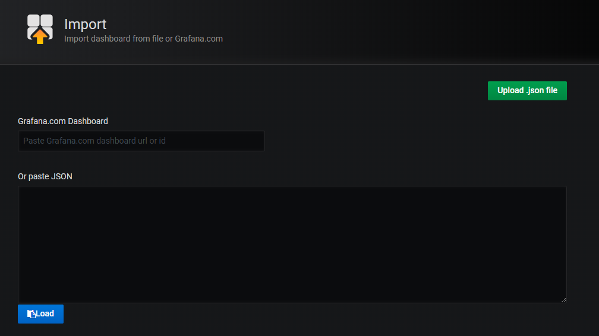

# Hướng dẫn giám sát Container sử dụng cAdvisor, Prometheus và Grafana
## Đầu bài:
Giám sát tình trạng hoạt động của các container trên host.

## Giải pháp:
 - cAdvisor để thu thập metric của container trên host
 - Prometheus để lưu trữ metric
 - Grafana để visualize metric thành biểu đồ theo dõi.


## Mô hình lab:
 - Docker host: IP 10.159.19.77
 - Prometheus: IP 10.159.19.84
 - Grafana: IP 10.159.19.84

## 1. Cài đặt cAdvisor để thu thập metric container
### 1.1. Trên Docker host, chạy lệnh sau để khởi tạo cAdvisor container
```sh
docker run -d \
--volume=/:/rootfs:ro \
--volume=/var/run:/var/run:ro \
--volume=/sys:/sys:ro \
--volume=/var/lib/docker/:/var/lib/docker:ro \
--volume=/dev/disk/:/dev/disk:ro \
--publish=8081:8080 \
--name=cadvisor \
google/cadvisor:latest
```
### 1.2. Kiểm tra cAdvisor container bằng cách truy cập `http://10.159.19.77:8081`


## 2. Cài đặt Prometheus để lưu trữ tập trung metric
### 2.1. Cài đặt Prometheus theo [hướng dẫn](https://github.com/longsube/ghichep-prometheus-v2/blob/master/docs/install_prometheus_container.md)

### 2.2. Chỉnh sửa file `prometheus.yml`, khai báo thêm thông tin của Docker host
```sh
  # The job name is added as a label `job=<job_name>` to any timeseries scraped from this config.
  - job_name: 'containeradvisor'
    # Override the global default and scrape targets from this job every 5 seconds.
    scrape_interval: 5s
    static_configs:
      - targets: ['10.159.19.77:8081']
```
### Khi muốn giám sát thêm host mới, chỉ cần thêm 1 target mới. VD:
```sh
    static_configs:
      - targets: ['10.159.19.77:8081']
      - targets: ['10.159.19.78:8081']
```

### 2.3. Khởi tạo hoặc Restart lại container Prometheus (nếu đã có) để lấy cấu hình mới
```sh
docker run -d --name prometheus -p 9090:9090 -v /root/prometheus/prometheus.yml:/etc/prometheus/prometheus.yml prom/prometheus --config.file=/etc/prometheus/prometheus.yml
```

### 2.4. Kiểm tra bằng cách truy cập giao diện của Prometheus tại `http://10.159.19.84:9091`
Vào "Status" -> "Service discovery", thấy xuất hiện các job của cAdvisor.


## 3. Cài đặt Grafana để visualize metric

### 3.1. Cài đặt Grafana
```sh
docker run -d -p 3000:3000 grafana/grafana
```

### 3.1. Truy cập vào dashboard của Grafana: 

`http://10.159.19.84:3000/`. `Tài khoản: admin, pass: admin` 

### 3.2. Thêm datasource của Prometheus

Khai báo IP và port của host Prometheus, sau đó "Save and Test"


### 3.3. Import file template sau để hiển thị đồ thị:
https://raw.githubusercontent.com/longsube/ghichep-minIO/master/tools/Container-metrics(cAdvisor).json



### 3.4. Kiểm tra giao diện đồ thị:


## Tham khảo:

[1] - https://medium.com/@bhargavshah2011/monitoring-docker-containers-using-cadvisor-and-prometheus-5350ae038f45

[2] - https://grafana.com/grafana/dashboards/10566