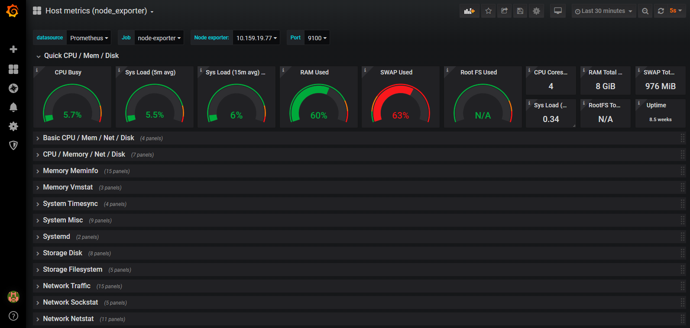

# Hướng dẫn giám sát Host vật lý sử dụng Node-exporter, Prometheus và Grafana
## Đầu bài:
Giám sát tình trạng hoạt động của các host vật lý.

## Giải pháp:
 - Node-exporter để thu thập metric của host.
 - Prometheus để lưu trữ metric.
 - Grafana để visualize metric thành biểu đồ theo dõi.


## Mô hình lab:
 - Host vật lý: IP 10.159.19.77
 - Prometheus: IP 10.159.19.84
 - Grafana: IP 10.159.19.84

## 1. Cài đặt Node-exporter để thu thập metric container
### 1.1. Trên Docker host, chạy lệnh sau để khởi tạo cAdvisor container
```sh
docker run -d --name node-exporter -p 9100:9100 prom/node-exporter
```
### 1.2. Kiểm tra bằng cách truy cập `http://10.159.19.77:9100`


## 2. Cài đặt Prometheus để lưu trữ tập trung metric
### 2.1. Cài đặt Prometheus theo [hướng dẫn](https://github.com/longsube/ghichep_prometheus/blob/master/docs/install_prometheus_container.md)

### 2.2. Chỉnh sửa file `prometheus.yml`, khai báo thêm thông tin của Docker host
```sh
  - job_name: 'node-exporter'
    # Override the global default and scrape targets from this job every 5 seconds.
    scrape_interval: 5s
    static_configs:
      - targets: ['10.159.19.77:9100']
```
### Khi muốn giám sát thêm host mới, chỉ cần thêm 1 target mới. VD:
```sh
    static_configs:
      - targets: ['10.159.19.77:9100']
      - targets: ['10.159.19.78:9100']
```

### 2.3. Khởi tạo hoặc Restart lại container Prometheus (nếu đã có) để lấy cấu hình mới
```sh
docker run -d --name prometheus -p 9090:9090 -v /root/prometheus/prometheus.yml:/etc/prometheus/prometheus.yml prom/prometheus --config.file=/etc/prometheus/prometheus.yml
```

### 2.4. Kiểm tra bằng cách truy cập giao diện của Prometheus tại `http://10.159.19.84:9091`
Vào "Status" -> "Service discovery", thấy xuất hiện các job của cAdvisor.


## 3. Cài đặt Grafana để visualize metric

### 3.1. Cài đặt Grafana
```sh
docker run -d -p 3000:3000 grafana/grafana
```

### 3.1. Truy cập vào dashboard của Grafana: 

`http://10.159.19.84:3000/`. `Tài khoản: admin, pass: admin` 

### 3.2. Thêm datasource của Prometheus

Khai báo IP và port của host Prometheus, sau đó "Save and Test"


### 3.3. Import file template sau để hiển thị đồ thị:
https://raw.githubusercontent.com/longsube/ghichep-minIO/master/tools/Host-metrics(node_exporter).json


### 3.4. Kiểm tra giao diện đồ thị:



## Tham khảo:

[1] - https://medium.com/@bhargavshah2011/monitoring-docker-containers-using-cadvisor-and-prometheus-5350ae038f45

[2] - https://grafana.com/grafana/dashboards/1860